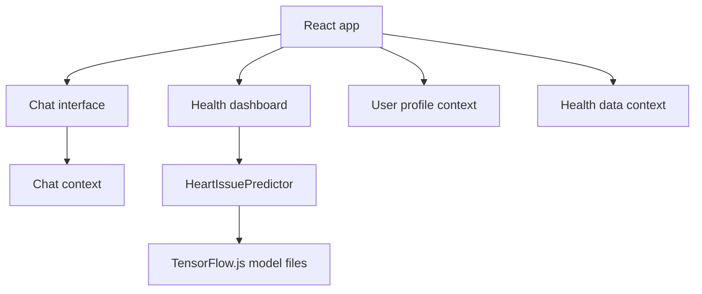

# Healthcare Assistant

React health assistant prototype with chat-style interaction, profile context, health dashboard components, and an in-browser TensorFlow.js heart-risk model.

> Portfolio positioning: secondary AI/health UI prototype. Do not pin unless the README, model card, and safety disclaimers are improved.

## Why This Project Matters

Healthcare AI projects need more than a chatbot interface. They must communicate model limitations, data handling, user context, and safety boundaries clearly. This repo can be repositioned as an applied human-centered AI prototype if it documents the prediction model and avoids medical overclaiming.

## Features

| Capability | Description |
|---|---|
| Chat interface | Conversational health-assistant UI. |
| Profile context | Stores user profile information in React context. |
| Health dashboard | Displays health-related state and quick actions. |
| Heart-risk predictor | Loads a TensorFlow.js model from `public/models`. |
| Settings | User-facing configuration surface. |

## System Architecture



## Tech Stack

| Layer | Tools |
|---|---|
| Frontend | React, JavaScript |
| Styling | CSS, Tailwind config |
| ML runtime | TensorFlow.js model assets |
| Testing | React test setup |

## Installation

```bash
npm install
npm start
```

Open:

```text
http://localhost:3000
```

## Safety Note

This project is a prototype and must not be presented as a medical device, diagnostic system, or replacement for professional care. Add a model card before making strong claims about prediction quality.

## Demo

Add:

```text
docs/demo/chat-flow.gif
docs/demo/heart-risk-predictor.png
docs/demo/dashboard.png
```

## Folder Structure

```text
healthcare-assistant/
├── public/
│   └── models/
│       └── heart_issue_model/
├── src/
│   ├── components/
│   ├── context/
│   ├── utils/
│   ├── App.js
│   └── model.js
├── package.json
└── README.md
```

## Future Improvements

- Add `MODEL_CARD.md` with dataset, inputs, outputs, limitations, and evaluation metrics.
- Add explicit privacy and safety documentation.
- Add form validation and uncertainty display around predictions.
- Add tests for model loading failure paths.
- Replace Create React App template remnants with project-specific docs.

## License

Recommended: MIT for UI code. Confirm licensing for any model or dataset used.
